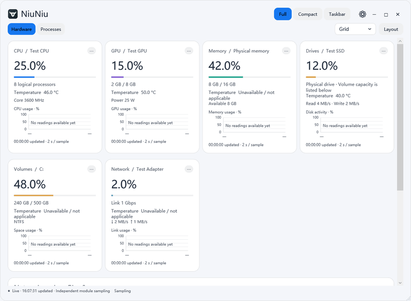
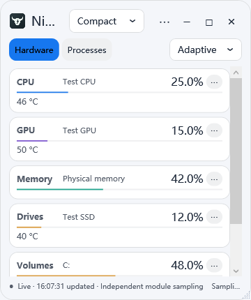
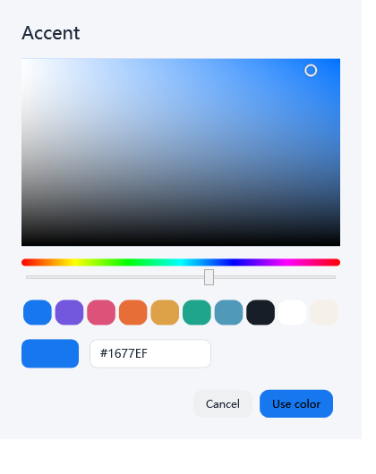

  
  <h1>牛牛 · 电脑状态与占用监控</h1>
  
电脑卡顿时查高占用程序，长任务时看负载与温度；用紧凑面板或任务栏持续看状态，按需接收温度提醒。 Find busy apps, watch load and temperatures, and keep readings in a compact panel or taskbar with optional alerts.

  
<a href="https://tagraysl.github.io/NiuNiu-Downloads/">下载网站 / Website</a> · <a href="README.zh-CN.md">完整中文介绍</a> · <a href="README.en.md">Full English guide</a> · <a href="https://github.com/Tagraysl/NiuNiu-Downloads/releases">GitHub Downloads</a>

## Windows 1.5.2 新功能

- 可选开机自启；占用页支持名称 A–Z/Z–A 排序；默认表头完整显示。
- 三种模式的硬件占用率每 10% 一档，绿 → 蓝 → 红，适配浅色与深色主题。
- 硬件模块“⋯”中的温度预警值可单独修改，三种模式共用。CPU 默认 85°C、GPU 核心 80°C、硬盘 60°C；达到阈值变红，降至阈值以下 2°C 恢复。
- 通用设置可开启 Windows 温度通知，默认关闭，并提供测试通知按钮。每次超温提醒一次，同一硬件至少间隔 5 分钟；Windows 勿扰及通知设置会影响显示。
- 更新前先完全退出旧版，沿用原程序及数据目录可保留配置。

## New in Windows 1.5.2

- Optional start with Windows, A–Z/Z–A process sorting, and readable initial column headers.
- Ten hardware-usage color bands from green through blue to red in all three modes, adapted to light and dark themes.
- Adjustable per-device temperature limits in module ⋯ settings, shared by all modes. Defaults: CPU 85°C, GPU core 80°C, drives 60°C. Red at the limit; normal again 2°C below it.
- Optional Windows temperature notifications in General settings, off by default, with a test button. One alert per overheating episode, at least five minutes apart per device. Windows notification and Do Not Disturb settings apply.
- Fully quit the old version before updating. Reuse the installation and data folders to retain settings.

## 下载 / Downloads

| 平台 / Platform | 版本 / Version | 下载 / Download |
|---|---|---|
| Windows x64 | **1.5.2**，当前主要版本 / primary release | [EXE 安装包 / Installer](https://github.com/Tagraysl/NiuNiu-Downloads/releases/tag/v1.5.2) |
| macOS · Apple Silicon | **0.1.0 预览 / preview** | [ARM64 .app ZIP](https://github.com/Tagraysl/NiuNiu-Downloads/releases/tag/v0.1.0-macos-preview) |
| macOS · Intel | **0.1.0 预览 / preview** | [x64 .app ZIP](https://github.com/Tagraysl/NiuNiu-Downloads/releases/tag/v0.1.0-macos-preview) |

**Mac 版尚未实机验证，功能未与 Windows 对齐。** 温度、每程序 GPU/网络流量、菜单栏直接显示文字等仍有缺项。两个平台的下载均未取得正式发布者签名认证；请阅读版本说明。

**The Mac build is an untested, incomplete preview.** Temperatures, per-process GPU/network metrics and inline menu-bar text are among the missing features. These downloads do not yet have trusted publisher signing/notarization; read the release notes.

## 界面预览 / Preview

> 图片来自实际 Windows 界面，以示例数据展示。GIF 由界面截图组成，用于演示页面与轮播内容，并非实时性能录像。 Images show the actual Windows interface with sample data. GIFs sequence captured UI states; they are feature previews, not live performance recordings.

| 紧凑监控 / Compact view | 多位置轮播 / Multi-slot carousel |
|---|---|
|  |  |

## 功能一览 / Feature overview

| 功能 / Feature | 中文 | English |
|---|---|---|
| 电脑参数 / Hardware | CPU、GPU、内存、物理硬盘、分区和网卡；占用、容量、温度及设备支持的传感器 | CPU, GPU, memory, physical drives, volumes and adapters; usage, capacity, temperature and available sensors |
| 程序占用 / Processes | 搜索程序/PID；按 CPU、GPU、内存、读写、网络流量、估算能耗排序；打开或结束进程 | Search app/PID; sort CPU, GPU, memory, I/O, network traffic and estimated energy impact; open or end processes |
| 三种模式 / Three modes | 完整仪表板、可调整大小的紧凑面板、真正嵌入 Windows 任务栏的指标 | Full dashboard, resizable compact panel and metrics embedded in the actual Windows taskbar |
| 紧凑展示 / Compact presentation | 自适应、首尾连续自动滚动、多位置硬件轮播、程序整页轮播 | Adaptive layout, continuous auto-scroll, multi-slot hardware carousel and paginated process carousel |
| DIY 布局 / DIY layout | 自定分组标题、多行、拖放模块；每个模块 1–4 格，空间不足自动换行 | Editable group titles, multiple rows, drag-and-drop modules and 1–4-column spans with wrapping |
| 独立设置 / Independent settings | 各模式分别选择内容；每模块自选参数、曲线与采样频率 | Separate content per mode; select fields, curves and sampling intervals per module |
| 可读曲线 / Readable charts | 指标名、纵轴刻度/单位、真实时间轴；缺失值断开 | Named metrics, value axes/units, real timestamps and gaps for unavailable readings |
| 网络 / Network | 网卡收发速率、流量、链路占用、Ping 延迟、连接概况；Ping0 公网 IP、地区、ASN 和运营商 | Adapter rates/totals/link usage, ping latency, connection overview; Ping0 public IP, location, ASN and provider |
| 外观 / Appearance | 浅色、深色、整套配色、色盘、字体字号和对齐；完整/紧凑配色同步 | Light/dark themes, palettes, color picker, fonts, sizes and alignment; shared Full/Compact colors |
| 语言 / Language | 简体中文 / English 即时切换，覆盖菜单、设置、曲线及提示 | Instant Simplified Chinese / English switching across menus, settings, charts and messages |
| 安装和数据 / Installation & data | EXE 内置运行环境，安装和数据目录可选；升级保留设置，卸载保留数据 | Self-contained EXE installer, selectable app/data locations, settings migration and data-preserving uninstall |

以上功能表描述 **Windows 1.5.2**；Mac 的范围见 [中文说明](platforms/macos/说明.md) / [Mac preview guide](platforms/macos/README.en.md)。

## DIY 与外观 / Layout & appearance

| 配色 / Colors | 曲线轴 / Chart axes |
|---|---|
|  |  |

## 开始使用 / Quick start

1. 下载 Windows EXE，选择语言、安装目录和数据目录。默认数据位置为安装目录下的 `Data`。 Download the Windows EXE and choose the language, installation folder and data folder. Data defaults to `Data` inside the installation folder.
2. 启动时允许 Windows 请求的管理员权限，以读取支持的硬件传感器和程序网络计数器。部分温度需要另装 [官方签名的 PawnIO 驱动](https://pawnio.eu/)。 Allow the Windows administrator prompt for supported sensors and per-process network counters. Some temperatures require the separate [official signed PawnIO driver](https://pawnio.eu/).
3. 在设置中选择语言、配色和各模式的内容。任务栏区域右键或双击可以恢复完整窗口。 Choose language, appearance and per-mode content in Settings. Right-click or double-click NiuNiu's taskbar area to restore the full window.

关闭窗口会询问收起到通知区域或完全退出。结束其他进程可能丢失未保存内容。温度取决于硬件支持；程序能耗为估算，不是实际瓦数。 Closing asks whether to hide in the notification area or quit. Ending another process can lose unsaved work. Sensor availability depends on hardware; per-process energy impact is an estimate, not watts.

## 指标、隐私和验证 / Metrics, privacy & validation

- 单位使用十进制 B / KB / MB / GB 和 KB/s / MB/s。网卡占用相对于链路速率；读写速率包含文件、网络和设备 I/O，与网络流量分开。 Units use decimal B / KB / MB / GB and KB/s / MB/s. Adapter utilization is relative to link speed. I/O includes file, network and device activity and is distinct from network traffic.
- 公网资料会查询 Ping0，默认启动时查询、之后每 10 分钟更新，可关闭或调整；本地网卡采样独立。高级资料需要自己的密钥，Windows 使用当前用户加密保存。 Public-IP lookup contacts Ping0 at startup and every 10 minutes by default; it can be disabled or adjusted independently of adapter sampling. Advanced fields require your own API key, encrypted for the current Windows user.
- 仓库不包含个人配置、密钥、诊断日志或本机网络报告。Windows 1.5.2 共 540 项检查通过，包含 356 项既有回归及实际 Windows 通知显示检查；本版未重做安装/卸载检查；Mac 只有跨平台逻辑、Windows 渲染器和打包检查，尚无 Mac 实测。 No personal settings, keys, diagnostic logs or local network reports are included. Windows 1.5.2 passed 540 checks, including 356 existing regression checks and an actual Windows notification display check. Installation/uninstallation checks were not repeated for this version. Mac validation covers shared logic, the renderer on Windows and package structure, not actual Mac execution.

详见 [验证范围 / Validation scope](docs/VALIDATION.md)、[第三方许可 / Third-party notices](THIRD-PARTY-NOTICES.md)。

## 下载仓库与许可 / Download repository & license

此公开仓库只分发网站、使用说明、图片和官方安装包，**不包含牛牛应用程序的核心源码**。核心源码保留在作者的私有仓库中。GitHub 自动生成的 “Source code” 压缩包仅包含本下载仓库的网站和文档，并非牛牛程序源码。

This public repository contains the website, documentation, media and official downloads, **not the application's core source code**. Application source remains private. GitHub's automatically generated “Source code” archives contain only this download repository's website and documents.

当前版本可免费安装运行，用于个人或组织内部使用，包括企业内部使用。牛牛原创部分保留所有权利，未经另行授权不得修改、再分发或售卖；后续版本可采用不同收费与许可方式。详见 [完整使用许可](LICENSE)。第三方组件继续遵守各自许可证。

This release is free to install and run for personal or internal organizational use, including business use. Rights to NiuNiu's original components are reserved; modification, redistribution and resale require separate permission. Future versions may use different pricing or terms. Read the [full usage license](LICENSE). Third-party components retain their own licenses.
