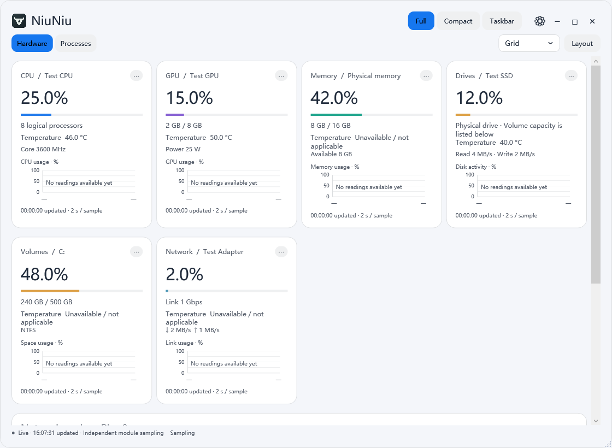
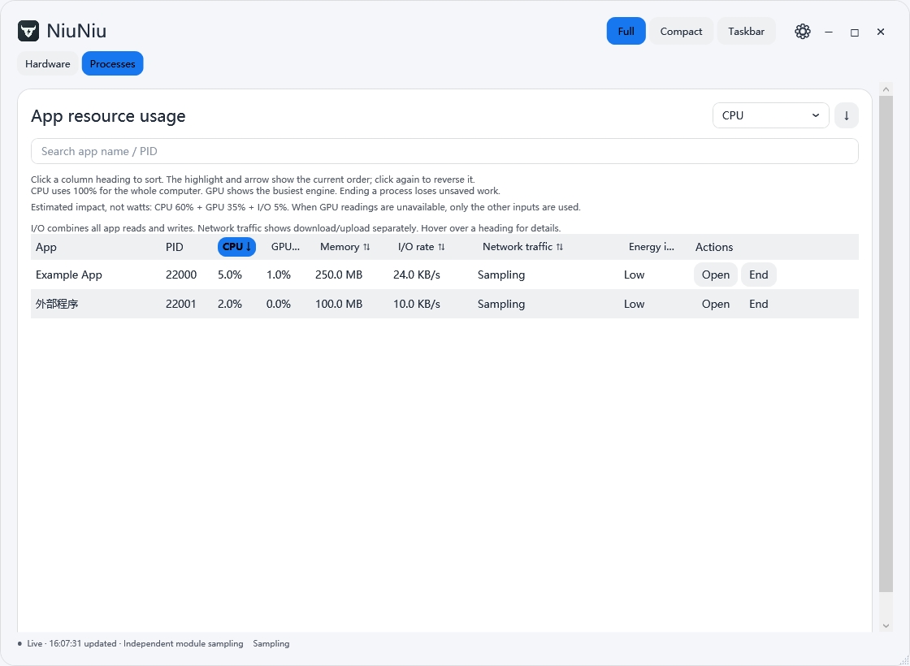
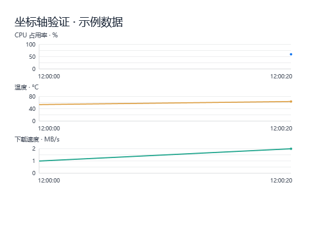

# 牛牛 · 完整中文介绍

[English](README.en.md) · [图文首页](README.md) · [下载](https://github.com/Tagraysl/NiuNiu-Downloads/releases)

牛牛是一款偏向简洁桌面体验的电脑监控工具：完整界面看细节，紧凑面板节省空间，Windows 任务栏随时查看关键指标。采用圆角卡片、统一间距与对齐规则，并提供中文和英文界面。

本页主要介绍 **Windows 1.5.0**。Mac 0.1.0 是独立开发的预览版，尚未实机验证，也未完成全部 Windows 功能的移植。

## 1. 电脑参数与占用

### 电脑参数

- **CPU**：整机归一化占用率、温度以及设备支持的频率、功耗等详细传感器。逻辑处理器数量也可显示。
- **GPU**：每块显卡的占用、已用/总显存，以及支持的温度、频率、功率等。不同硬件可提供不同的字段。
- **内存**：占用率、已用/总容量、可用容量等。没有真实温度传感器时明确显示不可用。
- **硬盘**：物理 SSD/HDD 的活动率、读写速率和可用温度。**磁盘/分区**则显示 C、D 等卷的已用/总空间、文件系统；分区没有独立温度。默认 DIY 布局把物理硬盘与分区分开。
- **网卡**：链路占用、链路速率、上传/下载速率与累计收发量。实体和虚拟网卡分别显示，不把多个网卡的转发流量简单相加。
- **详细传感器**：按实际硬件提供的数据列出，不为让 CPU/GPU 卡片看起来一样而删掉其中一类硬件的专有参数。

### 各程序的占用

完整窗口显示表格，紧凑窗口按排名从上到下显示。可按程序名/PID 搜索，按 CPU、GPU、内存、读写速率、网络流量或能耗影响排序。可点击的表头带提示；当前排序高亮，并显示升降序箭头，与排序下拉框同步。

- **打开**：尝试恢复已有窗口；无窗口时尝试让桌面打开其程序。后台服务不保证能打开可见界面。
- **关闭**：结束选中的进程，可能丢失未保存内容；不是终止整个进程树。关键系统进程和牛牛自身受保护，操作前核对 PID 和启动时间，避免 PID 重用导致误操作。
- 紧凑版默认保留程序排名、名称和操作按钮；可分别开启指标。拉宽后可在同一行补充放得下的当前排序值、内存、CPU/GPU 等信息，不改变从上到下的排序。
- 自选的详细指标始终保留，窄窗口可排到名称下方。菜单和按钮均可操作，悬停名称可看 PID。

## 2. 三种显示模式

| 模式 | 使用方式 |
|---|---|
| **完整** | 并排卡片或 DIY 分组；右上角最小化、最大化/还原、关闭；双击标题也可最大化 |
| **紧凑** | 可拖动、自由调整宽高，可选择置顶；独立切换电脑参数/占用、自适应/自动滚动/轮播 |
| **Windows 任务栏** | 直接挂接系统任务栏，以透明文字显示指标，配色跟随系统；不是另造一条仿任务栏窗口 |

紧凑模式默认 360×480，支持缩至 300×240并记住尺寸。空白、卡片正文和数值区域可拖动窗口，交互控件继续执行各自功能。长型号可横向滚动，CPU/GPU 等标签固定；鼠标移入暂停，也可以关闭型号滚动。

**自适应**根据空间安排内容；**自动滚动**让末项直接接首项连续循环，支持五档速度，鼠标移入、输入或打开菜单时暂停；内容全部放得下时保持静止。手动滚轮仍可用，隐藏或切换模式会停止动画。

**硬件轮播**根据窗口尺寸、字号和内容安排多个位置，每个位置轮播不同的模块队列。可选自动或最多 1–6 个展示位置，实际以空间为准。**程序轮播**按整页切换，显示排名范围；拉高增加每页条数，排序和搜索变化回到第一页。

任务栏多组指标默认每 5 秒轮换，可关闭或改成 3/5/10/15/30 秒。鼠标悬停和菜单打开时暂停；滚轮及菜单可以手动翻页。**在牛牛区域右键打开菜单、双击恢复完整窗口**。宽度和水平位置可微调，字体单独设置；此功能依赖 Windows 任务栏窗口结构，系统更新可能影响兼容性。

三种模式的关闭入口均提供**收起到托盘 / 完全退出 / 取消**。托盘右键可切换模式；图标是否被折叠到隐藏区域由 Windows 决定。

## 3. DIY 分组、多行与模块宽度

一个分组由**标题 + 一个或多个子行**构成。可编辑标题、增减子行、调整分组顺序，把模块拖入子行或从下拉框分配位置，也可以隐藏模块。删除分组会一起删除标题和行，但模块会移到剩余分组，不删除监控数据。

例如，四块硬盘可以放在“硬盘”标题下的一行；也可创建四个子行，每行一块。每个模块支持 **1–4 格**或自动宽度，参数增多时可加宽；所属子行空间不足会自动换行，不重复分组标题。“一类硬件一组”可快速恢复处理器、显卡、内存、硬盘、磁盘、网络的默认分组。

## 4. 独立采样、字段与曲线

卡片右上角的 **⋯** 打开模块设置，可选择编辑完整、紧凑或任务栏模式。各模式分别保存显示字段和曲线；模块采样频率与宽度在模式间共用。

- 模块采样间隔可选 1/2/3/5/10/15/30/60 秒，控制实际读取频率。
- 占用、容量、温度、频率/功耗/速率摘要、更新时间与详细传感器可分别选择。网络模块还可选择地区、IP、ASN、运营商等。
- 曲线总开关与每条曲线的选择分开，支持占用、温度及设备提供的频率、功耗、容量和收发速度等。
- 每条曲线显示指标名、纵轴数值/单位和真实时间轴；占用为 0–100%，不同单位不混在同一纵轴。每模块保留最近 60 个采样点，缺失读数处断开。
- 程序占用采样与公网资料刷新由通用设置分别管理。

## 5. 网络节点与延迟

直接请求 Ping0 官方接口获取当前系统出口的 IPv4/IPv6、地区、ASN、运营商；并提供网卡信息、连接概况和自定义地址的 ICMP 延迟检测。IPv6 查询失败会单独标记，不影响 IPv4 和本地网速。

高级资料包含风险分、原生 IP、机房属性，需要自己的 Ping0 API 密钥并开启高级 API。缺少密钥时明确提示，不推断或伪造结果；高级接口尚未使用真实用户密钥验证。密钥通过 Windows 当前用户加密保存。

**网速按秒采样，公网资料按分钟更新，互相独立。**默认启动时查询出口、之后每 10 分钟刷新；可选 1/5/10/30/60 分钟、关闭自动查询或手动刷新。轮播和滚动不会额外触发公网查询。

公网结果是当前系统路由/代理的出口，不是每张网卡独立的出口，也不保证与浏览器专用代理或 VPN 客户端显示的节点名称一致。

## 6. 配色、字体与语言

提供浅色、深色及海盐蓝、暖米白、薄荷绿、雾紫、玫瑰、午夜蓝等整套配色；可用色盘从主色生成配色，再分别调整窗口背景、卡片、文字和强调色。完整与紧凑模式双向同步配色，任务栏跟随 Windows。

各模式可分别选择字体、字号、对齐和显示内容；统一表单标签列、输入宽度和内边距。设置可预览、恢复默认，取消不写入修改。

**显示设置 → 通用 → 语言 / Language → 保存设置**，立即切换中文/英文。软件自己的菜单、按钮、设置、曲线和状态文本会翻译；程序名、硬件型号、路径、自写标题以及外部服务返回的地名等保留原文。

## 7. 安装、升级和真实限制

Windows x64 安装包内置 .NET 运行环境，可选择安装目录和数据目录，默认数据为安装目录下 `Data`。第一次从旧便携版升级会复制原设置和加密密钥，保留原件，不覆盖目的目录已有配置；卸载保留个人数据。更新前先完全退出旧版。

安装器使用普通用户权限；监控程序为读取硬件传感器和 ETW 网络计数器请求管理员权限。支持的 CPU/硬盘温度可能需要另装 [PawnIO 官方签名驱动](https://pawnio.eu/)，安装器仅提供默认不选的官网下载入口，不自动装驱动。

当前未正式签名，Windows 可能提示未知发布者或信誉不足。软件不添加杀毒排除项，不关闭内存完整性或其他防护，也不自动设置开机启动。正式签名也不保证新文件立即获得 SmartScreen 信誉。

Mac 包面向 macOS 13+，分 Apple Silicon 与 Intel。可自行移动 `.app`，首次运行选择数据目录，默认 `~/Library/Application Support/NiuNiu/Data`。**尚未 Mac 实测、未签名/公证，温度、风扇、真实功耗、程序 GPU/流量、菜单栏文字、部分 DIY 交互等未完成。**详见 [Mac 预览说明](platforms/macos/README.en.md)。

## 8. 指标口径与隐私

- B/KB/MB/GB/TB 按 1000 进位，二进制传感器数据先转换，非只改标签。
- CPU 按整机逻辑处理器数归一化；进程 GPU 取最忙引擎，与任务管理器口径未必相同。进程内存为工作集。
- 网卡占用是上下行较大值相对标称链路速率，并非互联网套餐占用率。
- 读写速率包含文件、网络和设备 I/O；网络流量使用 ETW TCP/UDP 的 IPv4/IPv6 事件，包含本机通信。代理转发可计在代理程序上，不应简单累加所有程序。只统计字节和进程身份，不记录通信内容。
- 能耗影响为 CPU 60%、GPU 35%、I/O 5% 的估算等级，不是实测瓦数，也不是 Windows 专有算法；硬件传感器的 W 值则为设备报告值。
- 采样中、无权限、不支持、事件不完整等状态明确显示，不用 0 冒充有效读数。
- 除用户开启的公网查询/延迟检测外，监控和设置保存在本机。Ping0 会看到请求的公网出口；配置可关闭自动查询。

[验证范围](docs/VALIDATION.md) · [更新记录](CHANGELOG.zh-CN.md) · [第三方许可](THIRD-PARTY-NOTICES.md)

---

**许可 / License:** 本版本免费用于个人及组织内部使用，牛牛核心源码不公开；未经另行许可不得修改、再分发或售卖原创部分。 / This version is free for personal and internal organizational use. Core source remains private; modifying, redistributing or reselling original components requires separate permission. [完整条款 / Full terms](LICENSE)
